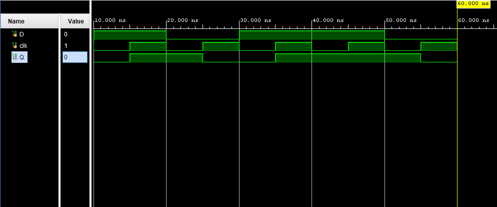
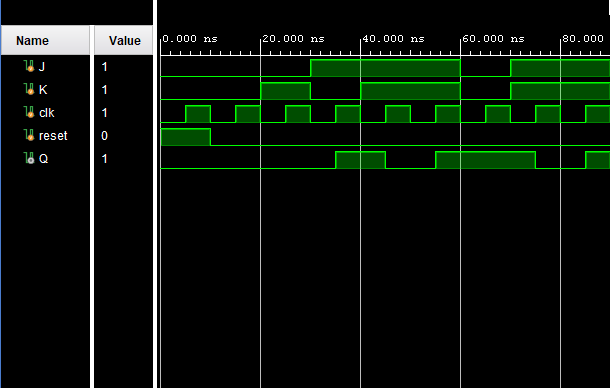
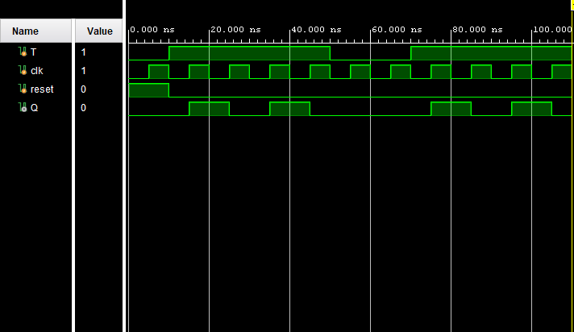

# Verilog Flip-Flop Designs

This repository contains the implementation and simulation of three fundamental flip-flops using Verilog HDL:

* D Flip-Flop
* JK Flip-Flop
* T Flip-Flop

Flip-flops are basic sequential storage elements used in digital systems. They form the foundation of registers, counters, memory units, and finite state machines (FSMs).

All designs were developed and verified using Xilinx Vivado.

---

# 1. D Flip-Flop

## Description

A D (Data) Flip-Flop stores one bit of information and updates its output on the positive edge of the clock.

### Characteristic Equation

```text
Q(next) = D
```

### Verilog Code

```verilog
module d_flipflop(
    input D,
    input clk,
    output reg Q
);

always @(posedge clk)
begin
    Q <= D;
end

endmodule
```

### Testbench

```verilog
`timescale 1ns / 1ps

module d_flipflop_tb;

reg D;
reg clk;

wire Q;

d_flipflop uut(
    .D(D),
    .clk(clk),
    .Q(Q)
);

always #5 clk = ~clk;

initial
begin
    clk = 0;

    D = 0; #10;
    D = 1; #10;
    D = 0; #10;
    D = 1; #10;
    D = 1; #10;
    D = 0; #10;

    $finish;
end

endmodule
```

### Waveform



### Waveform Analysis

The output Q follows the value of D only on the rising edge of the clock. Between clock edges, the output remains unchanged.

---

# 2. JK Flip-Flop

## Description

The JK Flip-Flop removes the invalid state present in the SR Flip-Flop and supports four operations: Hold, Reset, Set, and Toggle.

### Truth Table

| J | K | Operation |
| - | - | --------- |
| 0 | 0 | Hold      |
| 0 | 1 | Reset     |
| 1 | 0 | Set       |
| 1 | 1 | Toggle    |

### Verilog Code

```verilog
module jk_flipflop(
    input J,
    input K,
    input clk,
    output reg Q
);

always @(posedge clk)
begin
    case({J,K})
        2'b00: Q <= Q;
        2'b01: Q <= 0;
        2'b10: Q <= 1;
        2'b11: Q <= ~Q;
    endcase
end

endmodule
```

### Testbench

```verilog
`timescale 1ns / 1ps

module jk_flipflop_tb;

reg J;
reg K;
reg clk;

wire Q;

jk_flipflop uut(
    .J(J),
    .K(K),
    .clk(clk),
    .Q(Q)
);

always #5 clk = ~clk;

initial
begin
    clk = 0;

    J = 0; K = 0; #10;
    J = 0; K = 1; #10;
    J = 1; K = 0; #10;
    J = 1; K = 1; #10;
    J = 1; K = 1; #10;

    $finish;
end

endmodule
```

### Waveform



### Waveform Analysis

The waveform demonstrates all four modes of operation. When J and K are both HIGH, the output toggles at every positive clock edge.

---

# 3. T Flip-Flop

## Description

A T (Toggle) Flip-Flop changes its output state whenever T is HIGH during a clock edge.

### Truth Table

| T | Operation |
| - | --------- |
| 0 | Hold      |
| 1 | Toggle    |

### Verilog Code

```verilog
module t_flipflop(
    input T,
    input clk,
    output reg Q
);

always @(posedge clk)
begin
    if(T)
        Q <= ~Q;
    else
        Q <= Q;
end

endmodule
```

### Testbench

```verilog
`timescale 1ns / 1ps

module t_flipflop_tb;

reg T;
reg clk;

wire Q;

t_flipflop uut(
    .T(T),
    .clk(clk),
    .Q(Q)
);

always #5 clk = ~clk;

initial
begin
    clk = 0;

    T = 1; #40;

    T = 0; #20;

    T = 1; #40;

    $finish;
end

endmodule
```

### Waveform



### Waveform Analysis

When T = 1, the output alternates between 0 and 1 at each rising clock edge. When T = 0, the output retains its previous value.

---

# Comparison of Flip-Flops

| Flip-Flop    | Inputs | Main Function      |
| ------------ | ------ | ------------------ |
| D Flip-Flop  | D      | Data Storage       |
| JK Flip-Flop | J, K   | Set, Reset, Toggle |
| T Flip-Flop  | T      | Toggle Operation   |

---

# Applications

Flip-flops are widely used in:

* Registers
* Counters
* Shift Registers
* Memory Systems
* Digital Clocks
* Finite State Machines (FSMs)
* Communication Systems

---

# Conclusion

This repository presents the implementation and verification of D, JK, and T Flip-Flops using Verilog HDL. These designs provide the fundamental building blocks required for the development of more advanced sequential circuits such as counters, shift registers, and finite state machines.
